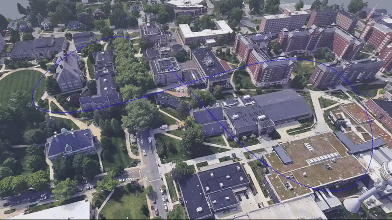
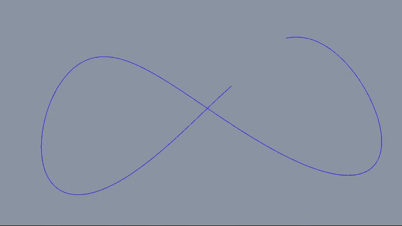
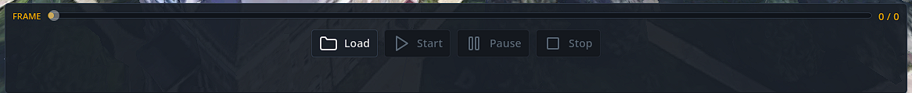
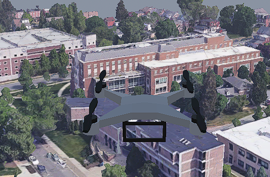
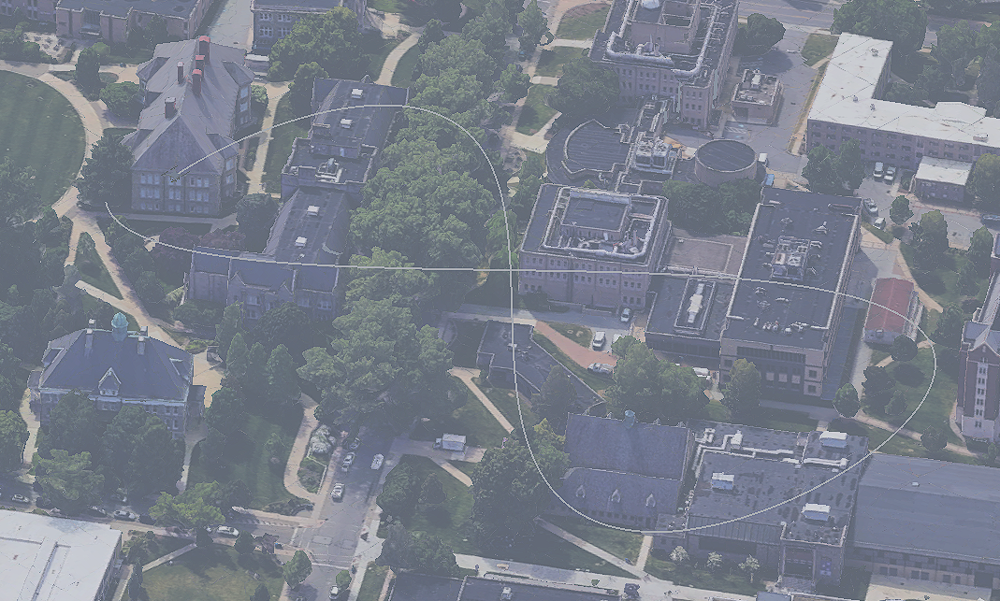
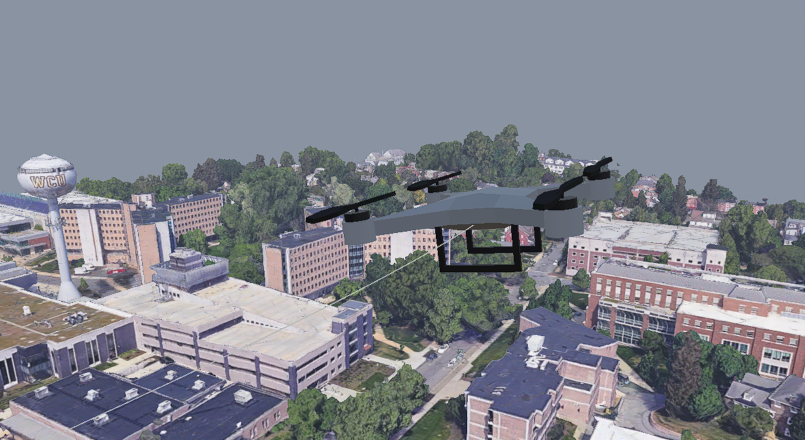
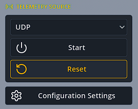
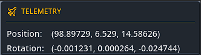
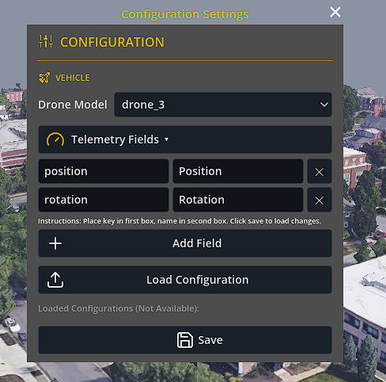

# SME-3D-Flight-Visualization

## Overview

This is the WCU Capstone Project GitHub repository for creating a **3D Flight Visualization System** for the client SME. 

The **SME 3D Flight Visualization System** is a real-time visualization platform that displays, records, and replays drone flight data in a 3D environment. 

The system ingests live telemetry data, renders a vehicle and its motion in the game engine Godot, and provides tools for playback and analysis of recorded flights.

## Key Features

* **Real-time drone flight visualization**
  * A vehicle model with proper rotation and positioning updated based on telemetry data  

|  Drone Flight  |
|----------------|
|   |

  * A flight path trail showcasing the overall flight path, and coloring based on rotational axes  

|  Flight Path  |
|---------------|
|   |

* **Telemetry ingestion (position, motion, 6 DOF data)**
  * Ingestion of a live data stream through UDP  

* **Flight recording**
  * Recording of flights saved as `.bin` files with their own "magic number."  

* **Playback of recorded flights**
  * Playback of flights for review that are recorded as `.bin`, allowing pausing and playback of any frame.

|  Playback Scrub Bar  |
|----------------------|
|   |

* **Multiple camera views (chase, fixed, free cam)**

| Chase Camera | Fixed Camera | Free Camera |
|-------------|-------------|-------------|
|  |  |  |

  
* **Interactive GUI controls**

  
|  Telemetry Source Panel  |  Telemetry Display Panel  |
|--------------------------|---------------------------|
|   |  |

* **Configurable Telemetry Info**

|  Configuration Menu  |
|----------------------|
|   |

* Performance optimization for embedded deployment (NVIDIA Orin Jetson Nano)

## Usage
This project's usage is determined by the project client, SME Inc. Additionally, it should be noted that the WCU Capstone team created this project with the intention of using it for debugging and visualization of real drone flight paths for analysis.

## Documentation

* Preliminary Design Review: [PDR](https://docs.google.com/document/d/1Io53l8OLiFt37tDIGmumXN_McZxw0aUMOFl7y7EOkto/edit?usp=sharing)
* Critical Design Review: [CDR](https://docs.google.com/document/d/1Z5zWZtCGHG4plFjhV0jLh7JmLLGI6e8ta2eVl4EMgng/edit?usp=sharing)
* Software Bill of Materials: [SBOM](https://docs.google.com/spreadsheets/d/1API0Ftx6VMUgp1QtHZcVUOFfPzrzNxY0XOXRW3iRzIk/edit?usp=sharing)
* User Guide: [User Guide](https://docs.google.com/document/d/1dPsuXEytbJLLZPuT6wFBMDOecsfgmMTlv3f0fk9o-T0/edit?usp=sharing)

## Testing

* The testing of this project was done with GUT unit testing in the Godot engine.
* Documentation of all unit tests: [Unit Tests](https://docs.google.com/spreadsheets/d/1F-_buREbD6vNOCIg8giTjLvqOO8VzGofhoiXCvi2gLw/edit?usp=sharing)
* Documentation of project VCRM: [VCRM](https://docs.google.com/document/d/1XNShHOQIiT4x-S8n2T375t95kNx27imvCer-pDf_yOM/edit?usp=sharing)

## Contributors
* Aramis Hernandez
* Carson Wood
* Clayton Lewis
* Clinton U
* David Shodipe
* Evan Visalli
* Nicholas Tran

# Handoff Notes

# Project Breakdown
### **Foundation:**  
FVS-14 → GitHub Setup  
FVS-13 → Modular Architecture Design (Break large system into small, independent building blocks)  
FVS-1 → Telemetry Ingest (Position Data, 6 DOF, Motion Data)  
FVS-3 → Vehicle logic and position updating  
### **Visual Layer:**  
FVS-2 → Choose a game engine to work with (Unreal, Unity, etc.)  
Game Engine Setup  
FVS-4 → Load in first vehicle model  
Connect the vehicle state to the real-time render in the game engine  
### **Functional Layer:**  
FVS-8 → Develop camera system (Chase, Fixed, Free Cam)  
FVS-9 → Develop GUI Controls  
FVS-6 → Develop Record/Replay system  
### **Performance Layer:**  
FVS-5 → FPS and performance optimization  
FVS-7 → Deploy to NVIDIA Jetson Board  
### **Completion:**  
FVS-11 → Produce final documentation (User Guide, Code Explanation)  
FVS-12 → Coding Standard  
FVS-15 → Testing with Agile Methodologies  
